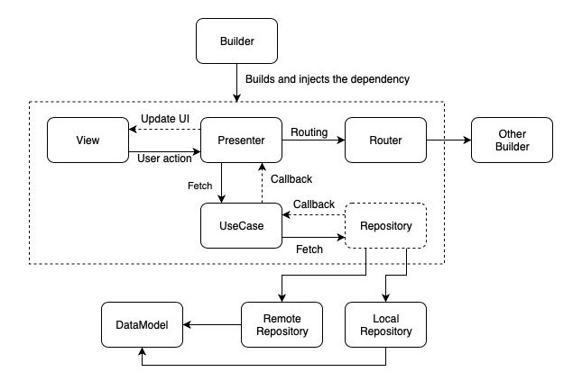

# Swift-MVP-Sample

It's a iOS simple project that how I implement `MVP` (Model-View-Presenter) and `Clean Architecture` in Swift. 

## Requirements

- Xcode 10.2+
- Swift 5.0+

## Architecture

### View Layer (MVP)
- `View` - Displays information from the `Presenter` and sends user interactions back to the `Presenter`.
- `Presenter` - Contains the presentation logic and tells the `View` what to present
- `ViewBuilder` - The `Builder’s` responsibility is to instantiate a specific `View` and injects the dependency for all components.
- `Router` - Handles navigation logic for which screen should appear and when.

### Domain Layer
- `UseCase` - Contains the business logic for a specific use case in the project. They are view agnostic and can be consumed by one or many `Presenters`.
- `Model` - Simple data model objects.

### Data Layer
- `Repository` - Query objects from different data sources (Core Data, Realm, web server, etc.) with a only single-entry point.

## References

- [iOS: MVP clean architecture in Tiendeo app](https://medium.com/tiendeo-tech/ios-mvp-clean-architecture-in-tiendeo-app-a8a597c49bb9)
- [Library - iOS - MVP + Clean Architecture Demo](https://github.com/FortechRomania/ios-mvp-clean-architecture/)
- [The Clean Architecture, by Uncle Bob](https://blog.cleancoder.com/uncle-bob/2012/08/13/the-clean-architecture.html)
- [Test Double](https://www.martinfowler.com/bliki/TestDouble.html)

## Author

Nixon Shih, powerwolf543@gmail.com

## License

Swift-MVP-Sample is available under the MIT license. See the LICENSE file for more info.
